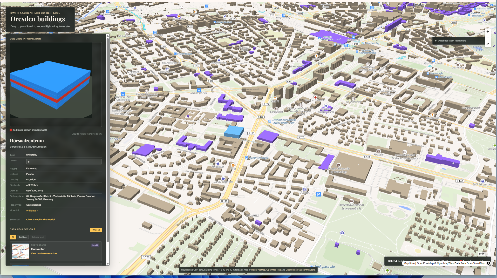

# Dresden buildings



## Windows installer (recommended for end users)

Windows users do not need Node.js, npm, PocketBase, or a server. Distribute the generated
`Dresden-Heritage-Setup-1.0.0.exe`; users can install and open it like a normal desktop application.
The application starts and stops its private local services automatically.

To create the installer on a development machine:

```sh
npm install
npm run desktop:windows
```

The installer is written to `release/`. It creates Start menu and optional desktop shortcuts.
On first launch, PocketBase creates an empty archive at
`%LOCALAPPDATA%\Dresden Heritage\pb_data` and applies the bundled schema migrations. The large
development database and its stored files are not included in the installer. Uninstalling or
upgrading the application does not delete user data. Back up that directory before manually
removing it or moving the archive to another computer.

The installer is currently unsigned, so Windows SmartScreen may display an unknown-publisher
warning. A production release should be signed with a Windows code-signing certificate.

The repository also includes a `Windows installer` GitHub Actions workflow. Run it manually from
the Actions page, or push a tag beginning with `v`, then download the installer artifact from the
completed workflow. This is the easiest way to build the Windows installer from Linux or macOS.

## Overview

The application launcher starts PocketBase first, waits for its health endpoint, and then starts the web application. It also stops both processes together.

The repository intentionally contains no `pb_data` database or uploaded archive files. When the
directory is absent or empty, PocketBase creates it and applies the schema from `pb_migrations`
before the application starts. Runtime data is ignored by Git and must not be committed.

## Installing PocketBase

1. Download the current stable PocketBase archive for your operating system and CPU from the [official PocketBase downloads](https://pocketbase.io/docs/).
2. Extract the archive.
3. Copy only the `pocketbase` executable into this project at:

```text
DataBaseRead/09_Pocketbase-2D-3D/pocketbase
```

On Linux or macOS, make the copied file executable and verify it:

```sh
chmod +x DataBaseRead/09_Pocketbase-2D-3D/pocketbase
DataBaseRead/09_Pocketbase-2D-3D/pocketbase --version
```

On Windows, copy `pocketbase.exe` to:

```text
DataBaseRead\09_Pocketbase-2D-3D\pocketbase.exe
```

Then verify it in PowerShell:

```powershell
.\DataBaseRead\09_Pocketbase-2D-3D\pocketbase.exe --version
```

### Using an existing installation

Instead of copying the executable, set `POCKETBASE_BIN` to its absolute path.

Linux or macOS:

```sh
POCKETBASE_BIN=/absolute/path/to/pocketbase npm run dev
```

Windows PowerShell:

```powershell
$env:POCKETBASE_BIN = "C:\absolute\path\to\pocketbase.exe"
npm run dev
```

### Existing database safety

PocketBase may upgrade an older database when a newer executable starts. Before the first launch with a new PocketBase version, back up the complete directory:

```text
DataBaseRead/09_Pocketbase-2D-3D/pb_data
```

The committed migrations in `pb_migrations` run automatically when PocketBase starts.

## Running the application

Development:

```sh
npm run dev
```

Production (after `npm run build`):

```sh
npm start
```

The PocketBase address defaults to `127.0.0.1:8090` and can be changed with `POCKETBASE_ADDRESS`. The dashboard is available at `http://127.0.0.1:8090/_/`.

For troubleshooting or deliberately running only the web application, use `npm run dev:app` or `npm run start:app`.

## Uploads without visitor sign-in

Visitors see the upload form immediately. On first startup, the launcher creates a private local upload account with a random password. Its credentials stay on the server and are stored in the ignored `.demo-upload-credentials.json` file; they are never included in browser code.

No additional setup is required when using `npm run dev` or `npm start`.

An existing archive account can optionally be supplied instead:

```sh
POCKETBASE_SUPERUSER_EMAIL=curator@example.org \
POCKETBASE_SUPERUSER_PASSWORD='replace-with-the-password' \
npm run dev
```

Alternatively, provide a revocable access token:

```sh
POCKETBASE_UPLOAD_TOKEN='replace-with-the-token' \
npm start
```

Do not commit either credential. Set `DEMO_UPLOADS=0` to disable uploads through the public form.
